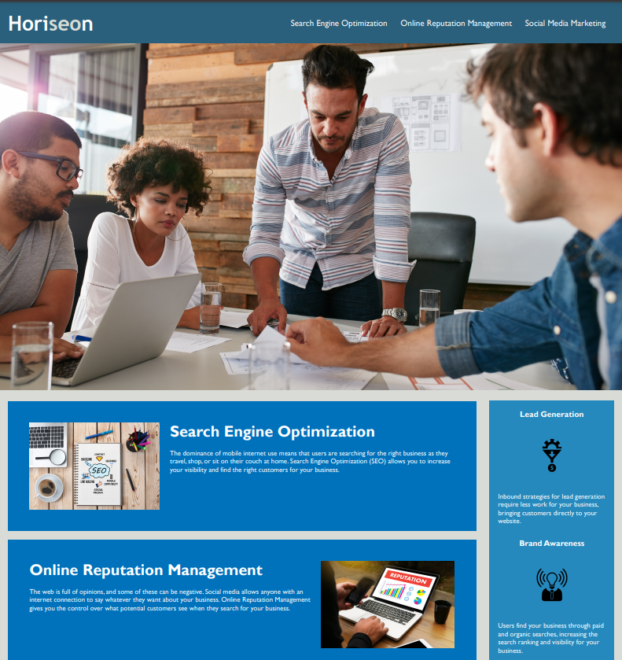
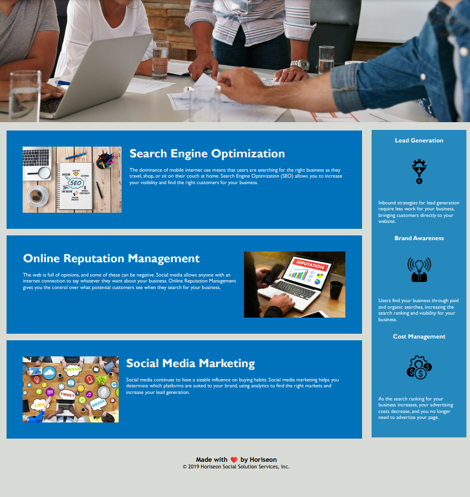

# horiseon-refactor-accessible

## Description

The motivation for this project is to assist marketing agency's goal in becoming more accessible online and deliver a website optimized for search engines. This project enables Horiseon, the marketing agency, to embody the core of its existence by boosting its online visibility with improved accessibility standards in the source code. 

While refactoring the code to meet these standards, all elements are checked for functionality and efficiency for long-term sustainability. Links are functioning correctly, CSS selectors and properties are consolidated for readability, semantic structures are improved in the HTML, and comments mark sections and elements appropriately.

The main takeaways from this project are identifying the necessary and unnecessary elements and selectors to style the page, which tags improve accessibility and aid the HTML structure, and creating the most effective alt text for images in context.

 
 

## Credits

Starter code and assets provided by Horiseon (EdX)

## License

MIT License

Copyright (c) [year] [fullname]

Permission is hereby granted, free of charge, to any person obtaining a copy
of this software and associated documentation files (the "Software"), to deal
in the Software without restriction, including without limitation the rights
to use, copy, modify, merge, publish, distribute, sublicense, and/or sell
copies of the Software, and to permit persons to whom the Software is
furnished to do so, subject to the following conditions:

The above copyright notice and this permission notice shall be included in all
copies or substantial portions of the Software.

THE SOFTWARE IS PROVIDED "AS IS", WITHOUT WARRANTY OF ANY KIND, EXPRESS OR
IMPLIED, INCLUDING BUT NOT LIMITED TO THE WARRANTIES OF MERCHANTABILITY,
FITNESS FOR A PARTICULAR PURPOSE AND NONINFRINGEMENT. IN NO EVENT SHALL THE
AUTHORS OR COPYRIGHT HOLDERS BE LIABLE FOR ANY CLAIM, DAMAGES OR OTHER
LIABILITY, WHETHER IN AN ACTION OF CONTRACT, TORT OR OTHERWISE, ARISING FROM,
OUT OF OR IN CONNECTION WITH THE SOFTWARE OR THE USE OR OTHER DEALINGS IN THE
SOFTWARE.

